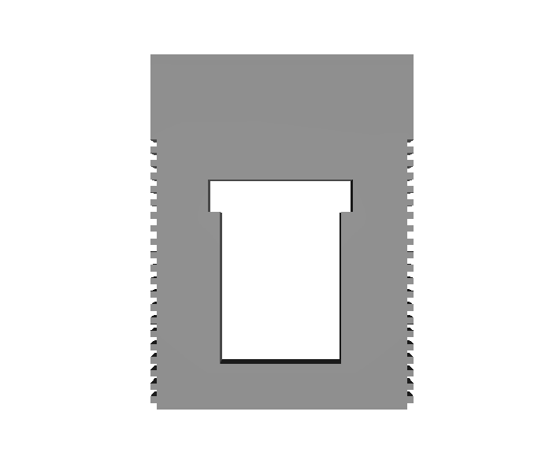
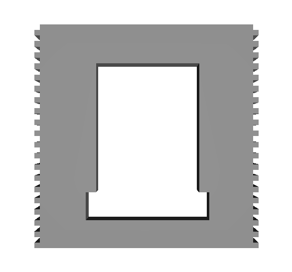
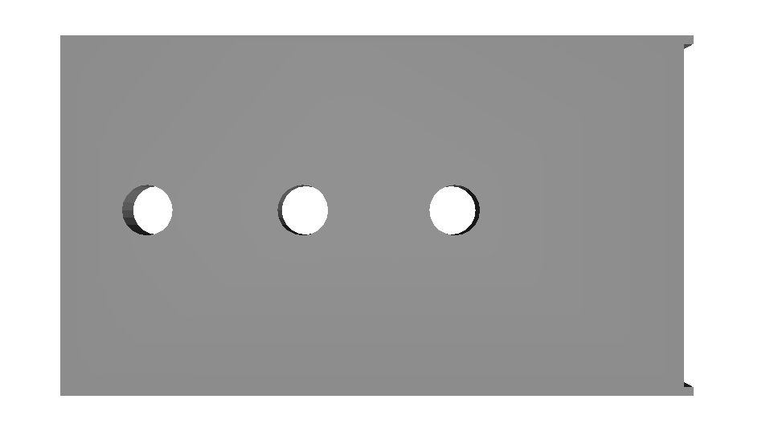
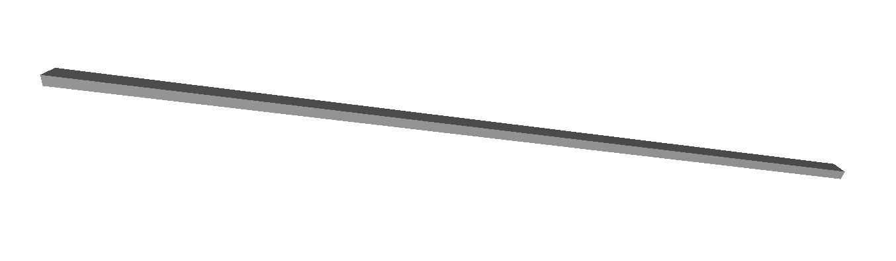
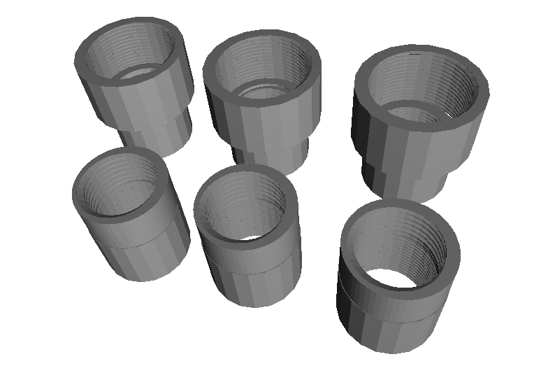
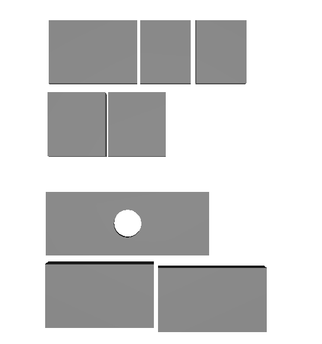
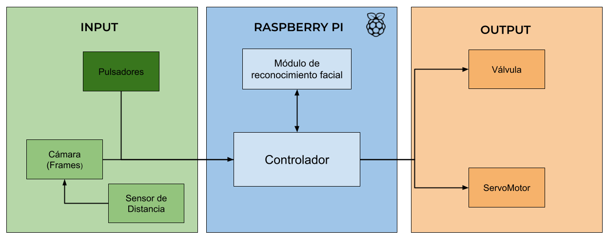

# Robotender

Dispensador de bebidas automático a través del reconocimiento facial de los usuarios.

# Tabla de Contenidos
   * [Descripción del proyecto](#descripción-del-proyecto)
   * [Demo](#demo)
   * [Requerimientos Ejecución](#requerimientos-ejecución)
   * [Funcionalidad Principal](#funcionalidad-principal)
   * [Guía de uso](#guía-de-uso)
      * [Caso 1: El usuario usa el robot por primera vez](#guía-de-uso)
      * [Caso 2: El usuario ha usado el robot previamente](#guía-de-uso)
   * [Componentes Electrónicos](#componentes-elctrónicos)
   * [Componentes Caja 3D](#componentes-caja-3D)
   * [Hardware Scheme](#hardware-scheme)
   * [Arquitectura de Software](#software-architecture)
   * [Software Modules](#software-modules)
   * [Additional Implementations](#additional-implementations)
   * [Built With](#built-with)
   * [License](#license)
   * [Use-case](#use-case)
   * [Amazing Contribution](#amazing-contribution)
   * [How to contribute](#How-to-contribute)
   * [Citing](#citing)
   * [Support](#support)
   * [Authors](#authors)
   * [Bibliography](#bibliography)

# Descripción del proyecto

Este proyecto tiene como objetivo cumplir con los requisitos del curso de Robótica. Consiste en el desarrollo de un robot completo, incluyendo tanto sus componentes de hardware como software.

En particular, nuestro enfoque se centra en la implementación de un robot capaz de dispensar diferentes bebidas al usuario utilizando el reconocimiento facial.

# Demo

# Funcionalidad Principal

El robot tiene la capacidad de servir bebidas a los usuarios basándose en el reconocimiento facial. Utilizando un modelo de visión por computador, el robot detecta las caras de las personas y, si el usuario ha seleccionado previamente su bebida preferida, el robot la dispensará automáticamente. 

En caso de que sea la primera vez que el usuario utilice el robot, este le solicitará que elija entre las tres opciones de bebidas disponibles, para que en futuras ocasiones el robot pueda servirle directamente su bebida favorita según su reconocimiento facial.

# Requirementos Ejecución

For running each sample code:

- [Python 3.9.x](https://www.python.org/)

# Guía de uso

Para utilizar el robot, el usuario simplemente necesita colocarse frente a la cámara del robot, que cuenta con un sensor infrarrojo para detectar la presencia de personas.

Cuando se detecta la presencia de una persona, se activa el módulo de reconocimiento facial, que identifica si hay una cara frente a la cámara.

## Caso 1: El usuario usa el robot por primera vez

Si es la primera vez que el usuario es detectado por el modelo, se le solicitará que elija su bebida preferida de entre las tres opciones disponibles, utilizando los botones correspondientes.

El usuario seleccionará su bebida preferida presionando uno de los tres botones, y a partir de esa elección, el robot comenzará a dispensar la bebida seleccionada.

## Caso 2: El usuario ha usado el robot previamente

En caso de que el usuario ya haya utilizado previamente el robot, este ya tendrá una bebida asociada y, por lo tanto, el robot dispensará automáticamente esa bebida sin que el usuario tenga que hacer ninguna selección adicional.

# Componentes Elctrónicos

|Nombre Componente|Imagen|Nombre Componente|Imagen|
|:--------------------------:|:----------------------------:|:----------------------------:|:----------------------------:|
| [Raspberry Pi 4 4GB RAM - Modelo B](https://www.pccomponentes.com/raspberry-pi-4-modelo-b-4gb?kgclid=Cj0KCQjw4NujBhC5ARIsAF4Iv6corx22IcBGrCHHz-85gy_z5JT9W28hMSXvh9uYoRDR4jNA0iECFtcaAuvtEALw_wcB&utm_source=366479&utm_medium=afi&utm_campaign=es-go.kelkoogroup.net&awc=20981_1685523698_497b309164e352e48e066c7e37d40d4c&utm_term=deeplink&utm_content=629D01H1RGN3NQQABHP7WYXVKRDEZY) |  | [Raspberry Pi Camera Rev 1.3](https://es.aliexpress.com/item/4001162865845.html?spm=a2g0o.ppclist.product.2.3d91WN0rWN0rwh&pdp_npi=2%40dis%21EUR%21%E2%82%AC%203%2C69%21%E2%82%AC%202%2C76%21%21%21%21%21%40211b5dfd16539403796157400e6948%2112000018174400524%21btf&_t=pvid%3A9a5ddde9-5795-4052-80bd-c3985eeb8d6a&afTraceInfo=4001162865845__pc__pcBridgePPC__xxxxxx__1653940380&gatewayAdapt=glo2esp) |  | |
| [Sensor Infrarrojo Sharp 2y0a21](https://es.rs-online.com/web/p/sensores-opticos-reflectantes/6666568?cm_mmc=ES-PLA-DS3A-_-google-_-CSS_ES_ES_Displays_y_Optoelectronica_Whoop-_-(ES:Whoop!)+Sensores+%C3%93pticos+Reflectantes+(2)-_-6666568&matchtype=&pla-362264014274&gclid=Cj0KCQjw4NujBhC5ARIsAF4Iv6dZDrrsCtV5F89tjWFADtBvWYdSQ1SJFB9AhaOn0aZQWHzbUovzOaMaAl1fEALw_wcB&gclsrc=aw.ds) |  | [Two Trees Stepping Motor Model 17HS4401](https://www.amazon.es/Twotrees-Nema-17-impresora-HS4401S/dp/B07SQNZ66Q/ref=asc_df_B07SQNZ66Q/?tag=googshopes-21&linkCode=df0&hvadid=513590746798&hvpos=&hvnetw=g&hvrand=12539990065257522260&hvpone=&hvptwo=&hvqmt=&hvdev=c&hvdvcmdl=&hvlocint=&hvlocphy=20270&hvtargid=pla-853487347177&psc=1) |  | |
| [Valvula con Solenoide 12V - 1/2](https://tienda.bricogeek.com/otros-sensores/937-valvula-con-solenoide-12v.html) |  | [A4988 Controlador para motor paso a paso](https://www.hta3d.com/es/a4988-controlador-motor-paso-a-paso-pololu-driver?gclid=CjwKCAjwpuajBhBpEiwA_Ztfhbq1hR--vj-H2azsVW6Nx2s-FVPZ3zZIGuDwAl1MMluSK8seG8oXqhoC9DoQAvD_BwE) |  | |
| [3 Push Buttons](https://www.digikey.es/es/products/detail/cui-devices/TS02-66-60-BK-100-SCR-D/15634358?utm_adgroup=Tactile%20Switches&utm_source=google&utm_medium=cpc&utm_campaign=Shopping_Product_Switches&utm_term=&productid=15634358&gclid=Cj0KCQjw4NujBhC5ARIsAF4Iv6f_8dzIUEkD_Q8xm6bYCE63TOHERH17kFTZA9TtDuOEQVtOX9fEyV0aAn0mEALw_wcB) |  | [DRV8825 Controlador paramotor paso a paso](https://www.e-ika.com/m%C3%B3dulo-paso-a-paso-drv8825) |  | 

# Componentes Caja 3D

|Nombre Pieza 3D|Imagen|Nombre Pieza 3D|Imagen|
|:--------------------------:|:----------------------------:|:----------------------------:|:----------------------------:|
| Pared Delantera de la Caja |  | Pared Trasera de la Caja |  | |
| Pared Superior de la Caja |  | Rail Interno Desplazamiento Vaso |  | |
| Juntas de las Válvulas |  | Piezas Interior de la Caja |  | |

# Hardware Scheme

# Software Modules

# Built With
- [TinkerCard](https://www.tinkercad.com/) - Model Design Program.
- [Arduino](https://www.arduino.cc/) - IDE used for the development of the servos.
- [VSCode](https://code.visualstudio.com/) - Code editor to program hardware components.
- [Python](https://www.python.org/) - Language used for programming.
- [Adoble Suit](https://www.adobe.com/) - For visual content creation.

# Use-Case
If this project helps your robotics project, please let us know with creating an issue.

# Amazing Contribution
- An emotional human-robot interaction never seen before.
- Table assistant 2.0 equipped with artificial intelligence.
- An assistant with next-level computer vision. Leaving current trade assistants behind.
- An easy-to-program framework to add new functionality to the robot.
- All the code is open-source and does not require the internet to work.

  
# Support 
- [Escola d'Enginyeria - UAB Barcelona](https://www.uab.cat/enginyeria/)
- [UAB Open Labs](https://www.uab.cat/open-labs/)

# Authors
* **Daniel Alcover** (https://github.com/danialcover)
* **Alexandre Galvany** (https://github.com/AlexGalPar14)
* **Jordi González** (https://github.com/Jordigg2000)
* **Fco Javier Honrubia** (https://github.com/javihonrubia)

# Bibliography

